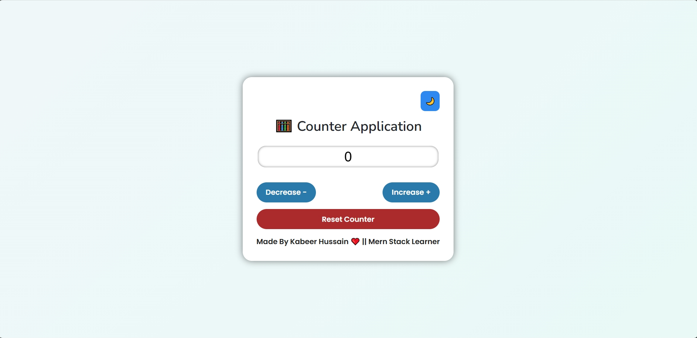

# 🔢 Counter Application (JavaScript Day 5)
**Live Demo:** 
[Click Here](https://counter-app-kabeer.vercel.app)

An elegant and fully interactive **Counter App** built with **pure JavaScript DOM manipulation**.  
This app lets users increase, decrease, or reset numbers with sound feedback, dynamic shadows, and a built-in **light 🌞 / dark 🌙 theme toggle**.

---

## 🚀 Features
✅ Increase and decrease counter dynamically  
✅ Reset counter to zero with sound effect  
✅ Responsive for all screen sizes  
✅ Light 🌞 and Dark 🌙 theme modes  
✅ Real-time color shadow change (green for +, red for -)  
✅ Smooth animations and button hover/touch effects  
✅ Works seamlessly on mobile & desktop  

---

## 🧱 Tech Stack & Architecture
- **Frontend:** Vanilla JavaScript + CSS (no frameworks)  
- **UI Generation:** Created dynamically using `document.createElement()`  
- **Event Handling:** Click, hover, touch, and resize events  
- **Theme System:** CSS + JavaScript toggle logic  
- **Sound Effects:** `Audio()` API for click and reset actions  

---

## 🧠 How It Works
1. App layout (buttons, heading, input field) is fully generated using JavaScript.  
2. Buttons control the counter value — increase ➕, decrease ➖, and reset 🔄.  
3. Shadow color changes according to number’s state (positive, negative, zero).  
4. Theme toggle switches between light and dark gradients dynamically.  

---

## 💡 Learning Goals
This project helps you master:
- DOM manipulation  
- Audio event handling  
- Conditional rendering  
- Responsive UI styling  
- Theme switching in JavaScript  

---

## 📸 Preview

---

## 🛠️ Developer Info
👨‍💻 **Developer:** Kabeer Hussain  
📘 **Series:** JavaScript — *30 Days, 30 Projects*  
📆 **Day:** 5 — *Counter Application*  
📧 **Email:** codealpha0786@gmail.com  
🔗 **GitHub:** [ITechKabeer](https://github.com/ITechKabeer)

Made by Kabeer Hussain ❤️ || Mern Stack Learner
